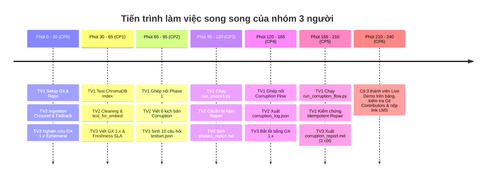

# KẾ HOẠCH PHÂN CHIA NHIỆM VỤ NHÓM 3 THÀNH VIÊN
## DAY 10: DATA PIPELINE & DATA OBSERVABILITY FOR RAG

> **Quy mô nhóm:** 3 thành viên  
> **Nguyên tắc phân bổ:** Tách biệt tuyệt đối theo thư mục mã nguồn (Directory-level Isolation), triệt tiêu 100% xung đột mã nguồn (Zero Merge Conflict), đảm bảo **cả 3 thành viên đều có commit độc lập trên nhánh `main`** và tự tin bảo vệ bài Live Demo.

---

## 👥 1. MA TRẬN PHÂN VAI & PHẠM VI QUẢN LÝ FILE

| Vai trò | Phụ trách chính | Thư mục & File code độc quyền | Sản phẩm bàn giao (Deliverables) |
| :--- | :--- | :--- | :--- |
| **Thành viên 1** | **Pipeline Lead & RAG Integrator** | • `src/pipelines/phase1.py`<br>• `src/pipelines/corruption_flow.py`<br>• `script/run_phase1.py`<br>• `script/run_corruption_flow.py`<br>• `src/retrieval/` (kiểm tra ChromaDB & QA)<br>• `docs/TEAM.md`, `report/group_report.md` | • Điều phối chạy 2 script toàn tuyến.<br>• Quản lý 3 collections ChromaDB (`baseline`, `corrupted`, `repaired`).<br>• Quản lý Git, merge code, bảo mật `.env`.<br>• Trình diễn chính Live Demo trên bảng. |
| **Thành viên 2** | **Data Foundation & Corruption Specialist** | • `src/ingestion/crossref.py`<br>• `src/ingestion/cleaning.py`<br>• `src/ingestion/corruption.py`<br>• `data/raw/`, `data/clean/` | • Thu thập Crossref API (kèm offline fallback).<br>• Clean schema, tính `age_days`, tạo `text_for_embedding`.<br>• Xây dựng bộ tiêm **6 dạng lỗi dữ liệu**.<br>• Cơ chế phục hồi an toàn (Idempotent Repair). |
| **Thành viên 3** | **Observability & Evaluation Lead** | • `src/observability/quality.py`<br>• `src/observability/reporting.py`<br>• `src/evaluation/testset.py`<br>• `src/evaluation/metrics.py`<br>• `data/quality/`, `data/reports/` | • Chốt kiểm dịch **Great Expectations 1.x** (4 expectations).<br>• Đánh giá độ tươi Freshness SLA.<br>• Sinh bộ đề thi chuẩn 10 câu `test_set.json`.<br>• Xuất 2 báo cáo Markdown đối chiếu 3 trạng thái. |

---

## 🛡️ 2. PHÂN QUYỀN FILE TUYỆT ĐỐI (TRÁNH XUNG ĐỘT GIT 100%)

Để đảm bảo không ai vô tình sửa đè code của nhau:

```text
src/
├── pipelines/        --> CHỈ THÀNH VIÊN 1 SỬA
├── retrieval/        --> CHỈ THÀNH VIÊN 1 PHỤ TRÁCH KIỂM TRA
├── ingestion/        --> CHỈ THÀNH VIÊN 2 SỬA
├── observability/    --> CHỈ THÀNH VIÊN 3 SỬA
└── evaluation/       --> CHỈ THÀNH VIÊN 3 SỬA
script/
├── run_phase1.py     --> THÀNH VIÊN 1
└── run_corruption... --> THÀNH VIÊN 1
```

*Quy tắc Git Branching:*
- Thành viên 1: Làm việc trên nhánh `feature/pipeline-lead`
- Thành viên 2: Làm việc trên nhánh `feature/data-foundation`
- Thành viên 3: Làm việc trên nhánh `feature/observability-eval`
- Sau khi từng thành viên chạy test thành công trên máy mình thì tạo Pull Request gộp vào `main`.

---

## ⏱️ 3. LỘ TRÌNH THEO TỪNG CHECKPOINT CHO NHÓM 3 NGƯỜI



---

### 🟢 GIAI ĐOẠN 1: KHỞI ĐỘNG & NỀN TẢNG (Phút 0 – 65)

#### Thành viên 1 (Pipeline Lead):
1. **(Phút 0 - 15):** Fork repo, mời 2 bạn vào làm Collaborators, cấu hình `.venv`, copy `.env.example` thành `.env`.
2. Kiểm tra smoke test:
   ```bash
   python -c "import chromadb, great_expectations, sentence_transformers; print('Môi trường sẵn sàng')"
   ```
3. Điền thông tin 3 thành viên vào `docs/TEAM.md`.
4. **(Phút 15 - 65):** Kiểm tra `src/retrieval/index.py` và `src/retrieval/qa.py`: Thử khởi tạo Chroma collection `papers-baseline`, kiểm tra kết nối mô hình nhúng `all-MiniLM-L6-v2` và LLM Provider (dùng `gemini` hoặc `mock`).

#### Thành viên 2 (Data Foundation):
1. **(CP0 - Phút 0 - 30):** Hoàn thiện `src/ingestion/crossref.py`:
   - Viết `parse_crossref_payload()`: Bóc tách DOI, Title, Summary (lọc sạch thẻ XML JATS), Authors, Published, Categories.
   - Viết `fetch_source_records()`: Tải dữ liệu, có cơ chế fallback tự động đọc file snapshot local `data/raw/crossref_response.json` khi API lỗi.
   - Lưu 2 file thô: `data/raw/crossref_response.json` và `data/raw/crossref_records.json`.
2. **(CP1 - Phút 30 - 65):** Hoàn thiện `src/ingestion/cleaning.py`:
   - Khử trùng lặp theo `paper_id`.
   - Tính toán tuổi thọ dữ liệu: `age_days = (run_date - published).days`.
   - Ghép chuỗi chuẩn ngữ cảnh `text_for_embedding` (Title + Authors + Published + Categories + Summary).
   - Xuất dữ liệu sạch ra `data/clean/papers_clean.csv` và `data/clean/papers_clean.json`.

#### Thành viên 3 (Observability & Quality Gate):
1. **(Phút 0 - 30):** Thiết lập môi trường, đọc kỹ chuẩn Great Expectations 1.x chế độ Ephemeral Context (`gx.get_context(mode="ephemeral")`).
2. **(CP1 - Phút 30 - 65):** Hoàn thiện `src/observability/quality.py`:
   - Xây dựng 4 Expectations bắt buộc trong `run_data_quality_checks()`:
     + `ExpectTableRowCountToBeBetween` (ngưỡng 5 - 5000 dòng).
     + `ExpectColumnValuesToNotBeNull` (`paper_id`, `title`, `text_for_embedding`).
     + `ExpectColumnValuesToBeUnique` (`paper_id`).
     + `ExpectColumnValueLengthsToBeBetween` (`summary` dài tối thiểu 30 ký tự).
   - Viết hàm `build_freshness_report()`: Tính tỷ lệ bài báo cũ `age_days > 180`. Nếu > 25% thì cảnh báo `is_fresh = False`.

---

### 🟡 GIAI ĐOẠN 2: BENCHMARK & BASELINE PIPELINE (Phút 65 – 120)

#### Thành viên 3:
1. **(CP2 - Phút 65 - 95):** Hoàn thiện `src/evaluation/testset.py`:
   - Viết hàm `build_test_set()`: Sinh 10 câu hỏi trắc nghiệm đánh giá phủ đủ 4 nhóm (`summary`, `authors`, `date`, `categories`).
   - Ghi ra file `data/eval/test_set.json`.
2. **(CP3 - Phút 95 - 120):** Hoàn thiện `generate_phase1_report()` trong `src/observability/reporting.py` để sinh file Markdown `data/reports/phase1_report.md`.

#### Thành viên 2:
1. **(CP2 - Phút 65 - 95):** Bắt tay vào viết sớm module tiêm lỗi `src/ingestion/corruption.py` (chuẩn bị trước cho CP4).
2. Viết sẵn hàm hỗ trợ nạp lại dữ liệu gốc từ `data/raw/crossref_records.json` để phục vụ khôi phục dữ liệu (Repair).

#### Thành viên 1:
1. **(CP2 - Phút 65 - 95):** Nạp dữ liệu sạch từ Thành viên 2 vào ChromaDB collection `papers-baseline`.
2. **(CP3 - Phút 95 - 120):** Ghép nối toàn bộ chu trình Pha 1 trong `src/pipelines/phase1.py` và chạy thử:
   ```bash
   python script/run_phase1.py
   ```
3. Xác nhận đã xuất hiện: `data/results/baseline_metrics.json` và `data/reports/phase1_report.md`.

---

### 🔴 GIAI ĐOẠN 3: CORRUPTION, REPAIR & BÁO CÁO 3 TRẠNG THÁI (Phút 120 – 210)

#### Thành viên 2 (Tạo "độc tố" & Cơ chế cứu hộ):
1. **(CP4 - Phút 120 - 165):** Hoàn thành hàm `corrupt_clean_dataframe()` trong `src/ingestion/corruption.py` với **đủ 6 dạng lỗi thực tế**:
   - 1. Bỏ rơi 20% bài mới nhất (*Drop latest records*).
   - 2. Xóa rỗng summary một số bài (*Blank summary*).
   - 3. Chèn chuỗi ký tự rác vào summary (*Inject noise*).
   - 4. Cắt ngắn title xuống < 8 ký tự (*Truncate title*).
   - 5. Lùi ngày xuất bản về 365 ngày trước (*Stale date*).
   - 6. Nhân bản dữ liệu (*Duplicate rows*).
   - Ghi nhật ký vào `data/results/corruption_log.json`.
2. **(CP5 - Phút 165 - 210):** Đảm bảo hàm đọc lại bản raw `load_raw_records()` tái tạo lại 100% dữ liệu sạch mà không bị ảnh hưởng bởi dữ liệu bẩn (*Idempotent Repair*).

#### Thành viên 3 (Đo lường & So sánh):
1. **(CP4 - Phút 120 - 165):** Chạy GX 1.x kiểm định trên dữ liệu bẩn $\rightarrow$ Xác nhận GX trả về `success = False` và Freshness báo động.
2. **(CP5 - Phút 165 - 210):** Hoàn thiện `generate_corruption_report()` trong `src/observability/reporting.py`:
   - Lập **Bảng so sánh đối đầu 3 trạng thái**:
     $$\text{Baseline (Sạch)} \longleftrightarrow \text{Corrupted (Lỗi)} \longleftrightarrow \text{Repaired (Phục hồi)}$$
   - So sánh định lượng: Số dòng, Tỷ lệ Pass GX, Tỷ lệ Freshness, Hit Rate, Token F1.
   - Xuất ra `data/reports/corruption_report.md`.

#### Thành viên 1 (Điều phối & Đo lường RAG):
1. Quản lý 2 collection ChromaDB riêng biệt: `papers-corrupted` và `papers-repaired`.
2. Kết nối toàn bộ luồng Pha 2 trong `src/pipelines/corruption_flow.py`.
3. Chạy lệnh:
   ```bash
   python script/run_corruption_flow.py
   ```
4. Xác nhận sinh đủ: `corrupted_metrics.json`, `repaired_metrics.json` và `corruption_report.md`.

---

### 🏁 GIAI ĐOẠN 4: REVIEW, LIVE DEMO & NỘP BÀI (Phút 210 – 240)

#### Phân công Live Demo trên bảng (3-5 phút):
- **Thành viên 1:** Mở terminal, chạy demo `run_phase1.py` và `run_corruption_flow.py`, trình bày kiến trúc luồng dữ liệu 7 tầng.
- **Thành viên 2:** Trình bày về 6 dạng lỗi tiêm vào dữ liệu, hiện tượng Silent Failure khi RAG bị đánh lừa, và nguyên lý phục hồi an toàn (Idempotent Repair).
- **Thành viên 3:** Trình bày về Trạm kiểm dịch Great Expectations 1.x, Freshness SLA và phân tích bảng đối chiếu 3 trạng thái trong `corruption_report.md`.

#### Checklist nghiệm thu trước 23:59:
- [ ] 1. Merge toàn bộ 3 nhánh tính năng vào nhánh `main`.
- [ ] 2. Mở GitHub $\rightarrow$ **Insights > Contributors**: Kiểm tra cả 3 thành viên đều có tên trên biểu đồ commit nhánh `main`.
- [ ] 3. Kiểm tra file `.env` **KHÔNG** bị đẩy lên GitHub.
- [ ] 4. Điền đầy đủ file `docs/TEAM.md` và `report/group_report.md`.
- [ ] 5. Mỗi thành viên tạo file báo cáo cá nhân `report/<MSSV>_<HoTen>.md`.
- [ ] 6. **CỰC KỲ QUAN TRỌNG:** Cả 3 thành viên tự đăng nhập tài khoản cá nhân trên VLearn LMS và nộp đường link repo nhóm!

---

## 💻 4. LỆNH KIỂM CHỨNG TỰ ĐỘNG ĐỘC LẬP (SELF-TEST SCRIPTS)

Mỗi thành viên có thể copy lệnh này chạy trong terminal máy mình để biết code mình đã đạt yêu cầu chưa:

### Thành viên 2 kiểm tra Ingestion & Cleaning:
```bash
# 1. Test tải raw data (yêu cầu ra: 24 bài báo)
python -c "from core.config import load_settings; from ingestion.crossref import fetch_source_records; s=load_settings(); r=fetch_source_records(s); print(f'Pass: {len(r)} records')"

# 2. Test clean data (yêu cầu ra: 24 dòng)
python -c "from datetime import datetime, timezone; from core.config import load_settings; from ingestion.crossref import load_raw_records; from ingestion.cleaning import build_clean_dataframe; s=load_settings(); df=build_clean_dataframe(load_raw_records(s.paths.raw_records_json), datetime.now(timezone.utc)); print(f'Pass: Cleaned {len(df)} rows')"

# 3. Test tiêm lỗi (yêu cầu ra: log lỗi được ghi)
python -c "from core.config import load_settings; from ingestion.corruption import corrupt_clean_dataframe; import pandas as pd; s=load_settings(); df=pd.read_json(s.paths.clean_json); c=corrupt_clean_dataframe(df, s.paths.corruption_log); print(f'Pass: Corrupted {len(c)} rows')"
```

### Thành viên 3 kiểm tra GX 1.x & Testset:
```bash
# 1. Test GX 1.x Quality Gate (yêu cầu ra: True)
python -c "from core.config import load_settings; from observability.quality import run_data_quality_checks; import pandas as pd; s=load_settings(); df=pd.read_json(s.paths.clean_json); res=run_data_quality_checks(df, s, 'test'); print(f'Pass: Quality Status = {res[\"success\"]}')"

# 2. Test sinh bộ đề thi (yêu cầu ra: 10 câu hỏi)
python -c "from core.config import load_settings; from evaluation.testset import build_test_set; import pandas as pd; s=load_settings(); df=pd.read_json(s.paths.clean_json); ts=build_test_set(df, s.paths.eval_testset); print(f'Pass: Created {len(ts)} questions')"
```

### Thành viên 1 kiểm tra toàn tuyến:
```bash
# Test Pha 1 (Baseline)
python script/run_phase1.py

# Test Pha 2 (Corruption & Repair)
python script/run_corruption_flow.py
```
